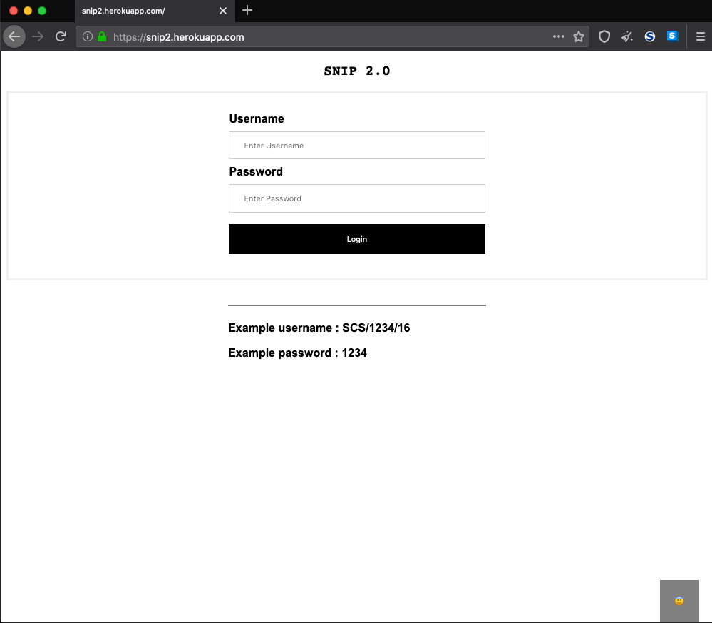
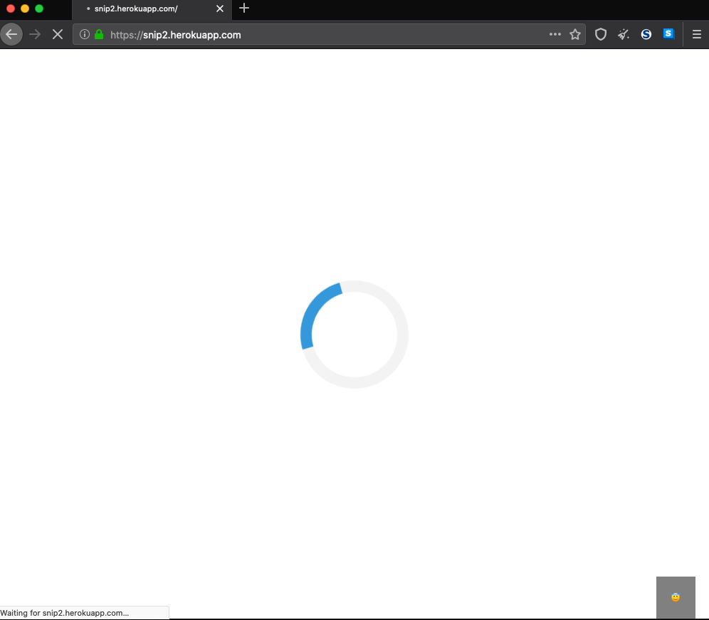
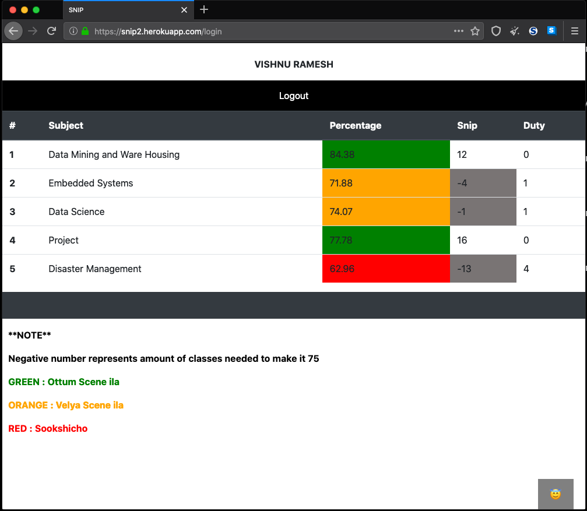

# snip2
THIS IS THE FLASK VERSION

Attendance monitoring app.  
apk for android users : https://drive.google.com/open?id=1qc_1ZFnWaVRq2ozVrbI6WAMdkB4AZazl   
URL : https://snip2.herokuapp.com

## Description
Gathers attendance related data from https://sset.ecoleaide.com/home.htm through an api which scrapes required data, when provided with username and password.

## API
Originally developed by RameesSalim (https://github.com/RameesSalim/). 
Added CORS support for javascript to access the api.
## API LINKS
Original api : https://ssetapi.herokuapp.com/v1/profile/attendance  
modified api : https://ssetvishnuapi.herokuapp.com/

## SCREEN SHOTS
#Login Page

#Loading Page

#Data Page
